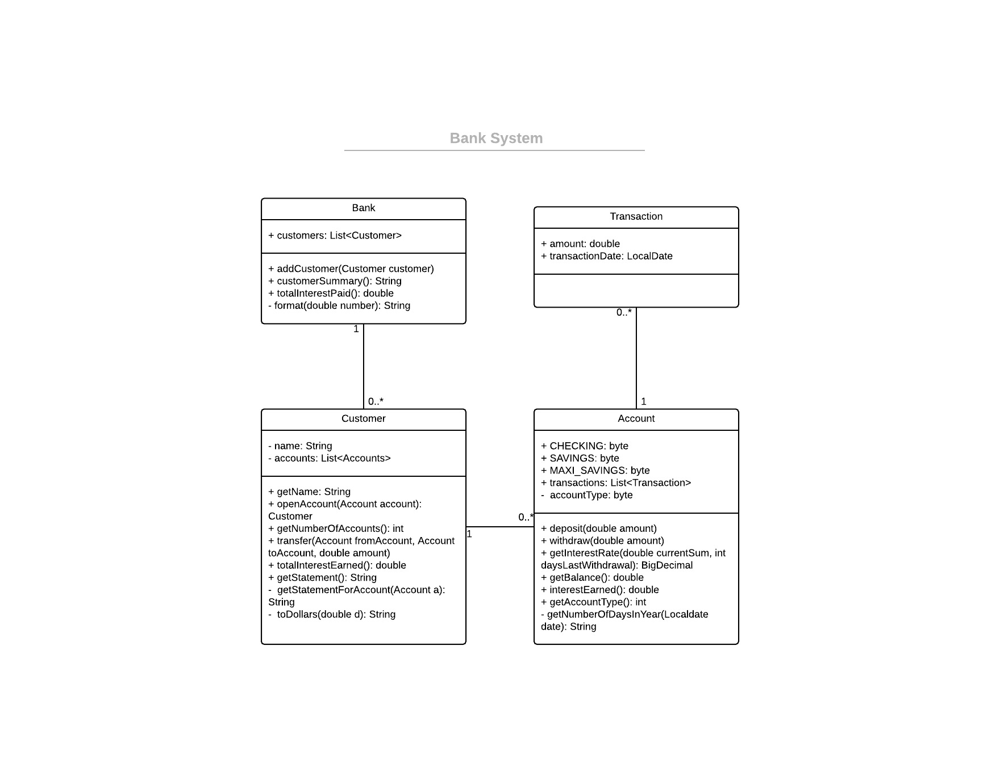

### UPDATE - January 2020
In this version of the update, additional features and changes have been made:
* Users can now transfer funds between their accounts
* Maxi-Savings accounts now have an interest rate of 5% assuming no withdrawals in the past 10 days otherwise 0.1%
* Time has been introduced, interest rates accrue and compound daily (incl. weekends)
* Due to floating point variables being sometimes inaccurate, BigDouble has been used to try and add more accuracy to operations. 
* Datatypes have been changed to better fit their variables, i.e. byte instead of int for account types
* DateProvider has been removed to instead be replaced with the LocalDate package, which is enough for the purpose of this program
* Some unused packages, functions and variables have been removed for better clarity
* Some testing issues were fixed
* Withdrawing more than account balance is not possible anymore
* Some code structures have been changed to better follow defensive designs
* Certain variable names have been changed to follow conventions (i.e. snake_case to camelCase)
* Additional testing functions have been implemented for the additional features
* Additional comments were added for clarity
* An UML diagram has been designed to allows future developement to be quickly picked up thanks to a faster understanding of the object-oriented design
* Future changes to UML diagram can be made [here](https://www.lucidchart.com/invitations/accept/4857632a-925a-4677-a5ac-f7c1a6fbdebe)

**UML Diagram**

Programming Test
========

This is a dummy application to be used as part of a software development interview.

instructions
--------

* Treat this code as if you owned this application, do whatever you feel is necessary to make this your own.
* There are several deliberate design, code quality and test issues that should be identified and resolved.
* Below is a list of the current features supported by the application; as well as some additional features that have been requested by the business owner.
* In order to work on this take a fork into your own GitHub area; make whatever changes you feel are necessary and when you are satisfied submit back via a pull request. See details on GitHub's [Fork & Pull](https://help.github.com/articles/using-pull-requests) model
* Be sure to put your name in the pull request comment so your work can be easily identied.
* The project uses maven to resolve dependencies however if you want to avoid maven configuration the only external JAR that's required is junit-4.11.
* Refactor and add features (from the below list) as you see fit; there is no need to add all the features in order to "complete" the exercise. Keep in mind that code quality is the critical measure and there should be an obvious focus on testing.
* You'll notice there is no database or UI; these are not needed - the exercise deliberately avoids these requirements.
* REMEMBER: this is YOUR code, make any changes you feel are necessary.
* You're welcome to spend as much time as you like.
* The code will be a representation of your work, so it's important that all the code--new and pre-existing--is how you want your work to be seen.  Please make sure that you are happy with ALL the code.

abc-bank
--------

A dummy application for a bank; should provide various functions of a retail bank.

### Current Features

* A customer can open an account
* A customer can deposit / withdraw funds from an account
* A customer can request a statement that shows transactions and totals for each of their accounts
* Different accounts have interest calculated in different ways
  * **Checking accounts** have a flat rate of 0.1%
  * **Savings accounts** have a rate of 0.1% for the first $1,000 then 0.2%
  * **Maxi-Savings accounts** have a rate of 2% for the first $1,000 then 5% for the next $1,000 then 10%
* A bank manager can get a report showing the list of customers and how many accounts they have
* A bank manager can get a report showing the total interest paid by the bank on all accounts

### Additional Features

* A customer can transfer between their accounts
* Change **Maxi-Savings accounts** to have an interest rate of 5% assuming no withdrawals in the past 10 days otherwise 0.1%
* Interest rates should accrue and compound daily (incl. weekends), rates above are per-annum
